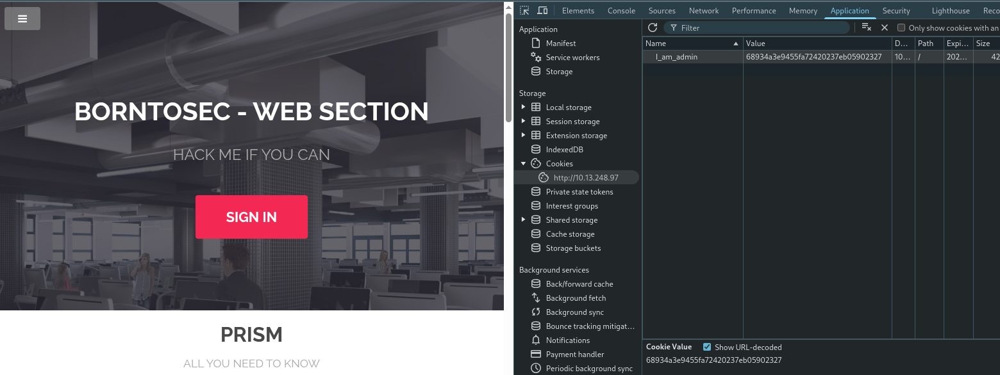
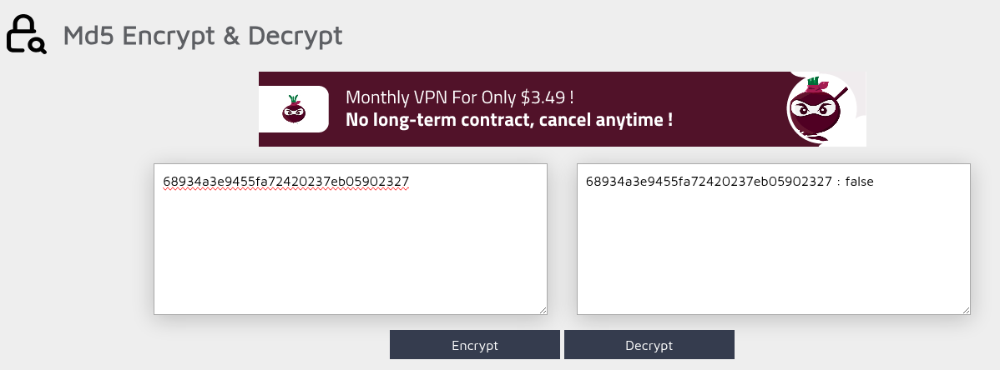
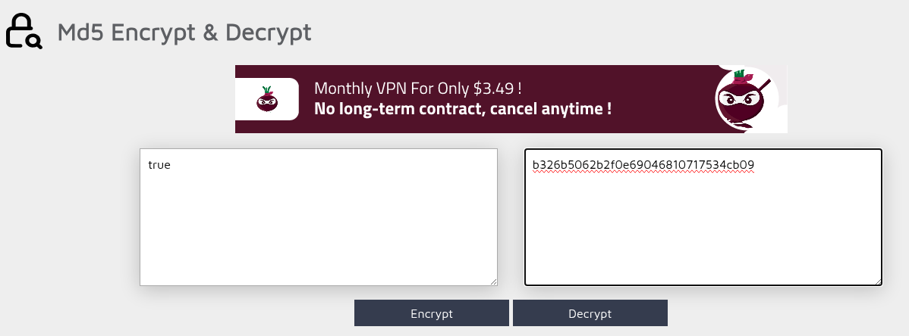
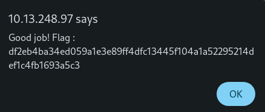

# Cookie as admin (Cookie Manipulation)

## Découverte
Nous avons trouvé un cookie nommé "I_am_admin" avec la valeur "68934a3e9455fa7242023eb05902327" dans les outils de développement.

## Vulnérabilité
Faille de type **"Insecure Cookie Handling"** où l'application détermine les droits d'admin via un cookie facilement modifiable. La valeur est un hash MD5 de "false".

## Exploitation
1. Décodage du cookie : "68934a3e9455fa7242023eb05902327" = MD5("false")
   

2. Création d'un nouveau hash : MD5("true") = "b326b5062b2f0e69046810717534cb09"
   

3. Remplacement du cookie et rafraîchissement de la page pour obtenir le flag
   

## Prévention
- Ne pas stocker de droits d'accès dans les cookies
- Utiliser des sessions côté serveur
- Vérifier les permissions à chaque requête
- Préférer des jetons JWT signés avec durée limitée