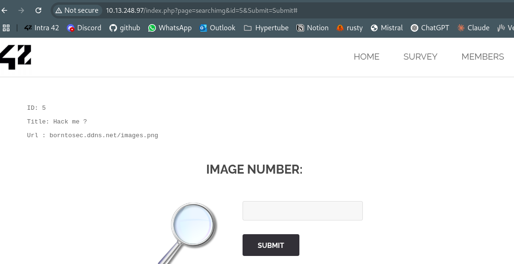
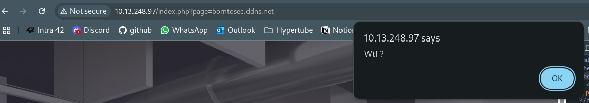
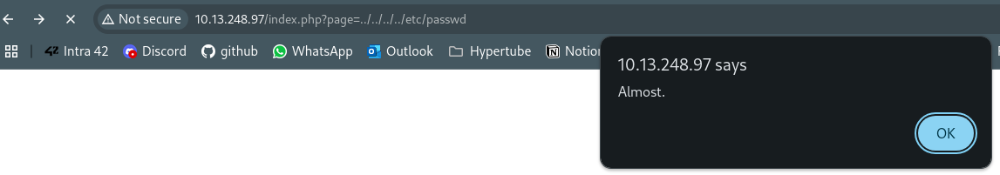
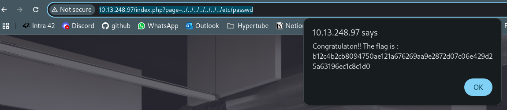

# Local File Inclusion (LFI)

## Découverte
Nous avons découvert que le paramètre "page" dans l'URL est vulnérable à une attaque de type Local File Inclusion (LFI), permettant d'accéder à des fichiers sensibles du système.
http://10.13.248.97/index.php?page=../../../../../../../etc/passwd

## Vulnérabilité
Faille de type **"Local File Inclusion (LFI)"** où l'application inclut des fichiers fournis via des paramètres d'entrée sans validation suffisante, permettant à un attaquant d'accéder à des fichiers sensibles sur le serveur.

## Exploitation
1. La decouverte de l'indice sur le resultat de la recherche de l'image 5:
   

2. Observation initiale de la structure de l'URL sur la page de l'image 5: 
   ```
   http://10.13.248.97/index.php?page=searchimg&id=5&Submit=Submit
   ```
   
3. Test direct de manipulation du paramètre "page" en le remplaçant par une référence à un domaine externe:
   ```
   http://10.13.248.97/index.php?page=borntosec.ddns.net
   ```
   Ce qui a déclenché une alerte avec le message popup "Wtf?"
   

4. Test de la vulnérabilité LFI via le paramètre "page" en utilisant une traversée de répertoire:
   

5. Obtention du flag
   


## Prévention
- Valider rigoureusement tous les paramètres d'entrée, en particulier ceux utilisés pour spécifier des chemins ou des fichiers
- Implémenter une liste blanche des fichiers accessibles plutôt qu'une liste noire
- Éviter d'utiliser les entrées utilisateur pour construire des chemins de fichiers
- Utiliser des mécanismes d'isolation comme des conteneurs ou chroot
- Appliquer le principe du moindre privilège pour l'utilisateur exécutant l'application web