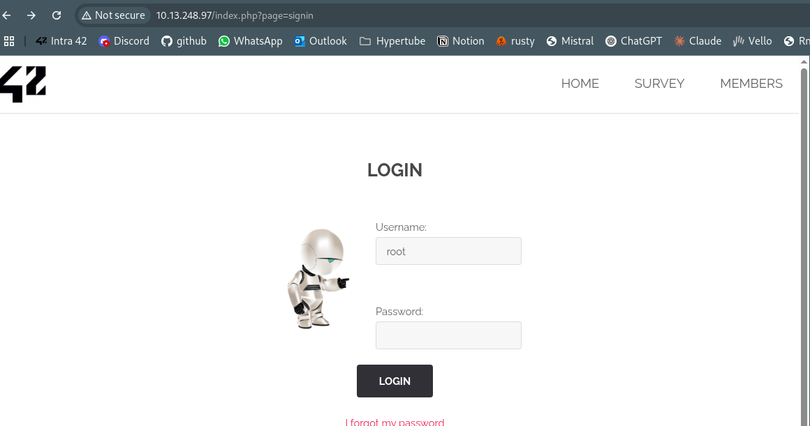
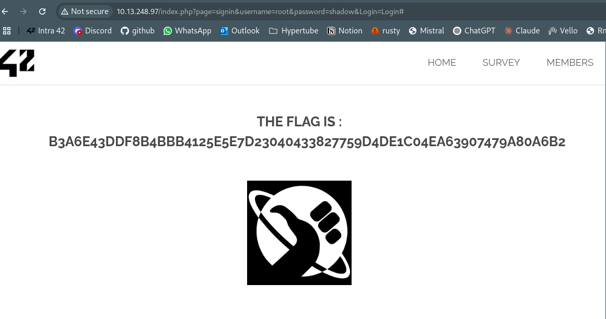

# Brute Force Login Vulnerability

## Découverte
Nous avons découvert que le formulaire de connexion du site web est vulnérable aux attaques par force brute, sans aucune protection contre les tentatives multiples.
http://10.13.248.97/index.php?page=signin

## Vulnérabilité
Faille de type **"Brute Force Attack"** où l'application ne met pas en place de mécanismes pour limiter les tentatives de connexion répétées, permettant ainsi à un attaquant de tester un grand nombre de combinaisons de mots de passe.

## Exploitation
1. Identification du formulaire de connexion vulnérable
   

2. Analyse de la structure de la requête de connexion via l'inspection du réseau dans le navigateur
   ```
   GET /index.php?page=signin&username=root&password=shadow&Login=Login
   ```

3. Développement d'un script Python pour automatiser les tentatives de connexion avec une liste de mots de passe courants

4. Exécution du script et découverte du mot de passe correct: "shadow"
   ```
   Tentative 18: shadow
   ==================================================
   SUCCÈS! Mot de passe trouvé: shadow
   URL: http://10.13.248.97/?page=signin&username=root&password=shadow&Login=Login
   Nombre de tentatives: 18
   Temps écoulé: 35.90 secondes
   ==================================================
   ```

5. Connexion réussie et accès aux informations protégées, y compris le flag
   

## Impact
Cette vulnérabilité permet à un attaquant de:
- Découvrir des identifiants valides par une approche d'essai-erreur
- Accéder à des zones protégées du site web sans autorisation légitime
- Compromettre des comptes utilisateurs, en particulier ceux ayant des mots de passe faibles
- Voler des données sensibles ou des informations personnelles

## Prévention
- Mettre en place une politique de limitation de tentatives (rate limiting)
- Implémenter un système de verrouillage temporaire de compte après plusieurs échecs
- Utiliser des captchas après un certain nombre de tentatives échouées
- Exiger des mots de passe forts et complexes
- Mettre en place une authentification à deux facteurs (2FA)
- Journaliser et surveiller les tentatives de connexion multiples provenant d'une même IP
- Implémenter un délai progressif entre les tentatives échouées