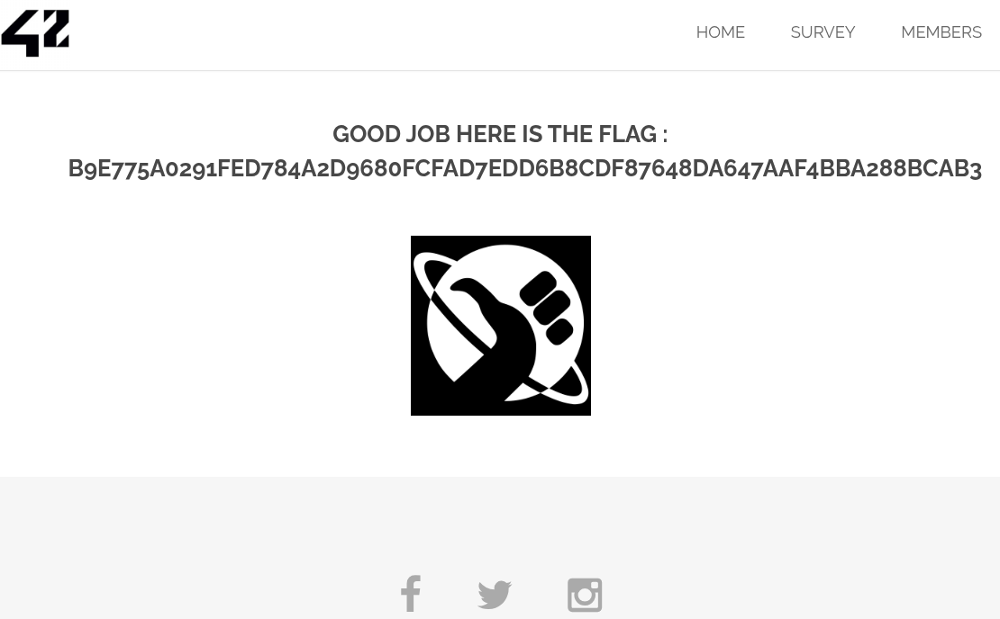

# Social Media Link Spoofing (Link Manipulation)

## Découverte
Nous avons découvert que les liens vers les réseaux sociaux dans le pied de page du site web peuvent être manipulés pour rediriger les utilisateurs vers des sites malveillants.
http://10.13.248.97/index.php

## Vulnérabilité
Faille de type **"Link Manipulation"** ou **"Open Redirect"** où l'application permet la redirection des utilisateurs vers des sites externes sans validation appropriée des URL.

## Exploitation
1. Inspection du code source de la page dans la console pour identifier la structure des liens de réseaux sociaux
   

2. Identification des liens vulnérables qui utilisent un paramètre de redirection:
   ```
   <a href="index.php?page=redirect&site=google" class="icon fa-facebook">...</a>
   ```

3. Modification du paramètre de redirection pour pointer vers un autre site
   

4. Vérification que le lien modifié redirige effectivement vers le site spécifié
   

## Impact
Cette vulnérabilité pourrait permettre à un attaquant de:
- Créer des liens de phishing qui semblent légitimes
- Rediriger les utilisateurs vers des sites malveillants
- Exploiter la confiance que les utilisateurs ont dans le site d'origine

## Prévention
- Implémenter une liste blanche d'URLs autorisées pour les redirections
- Valider toutes les URL de redirection côté serveur
- Utiliser des redirections relatives plutôt que des redirections absolues
- Implémenter des pages intermédiaires d'avertissement pour les redirections externes
- Éviter d'utiliser des paramètres GET pour les redirections sensibles