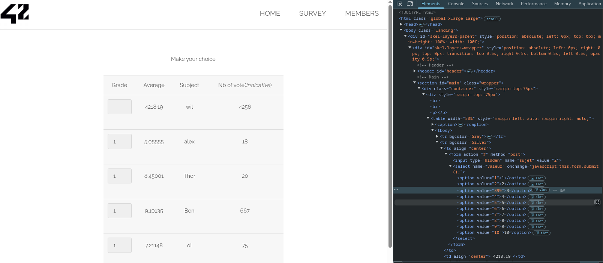
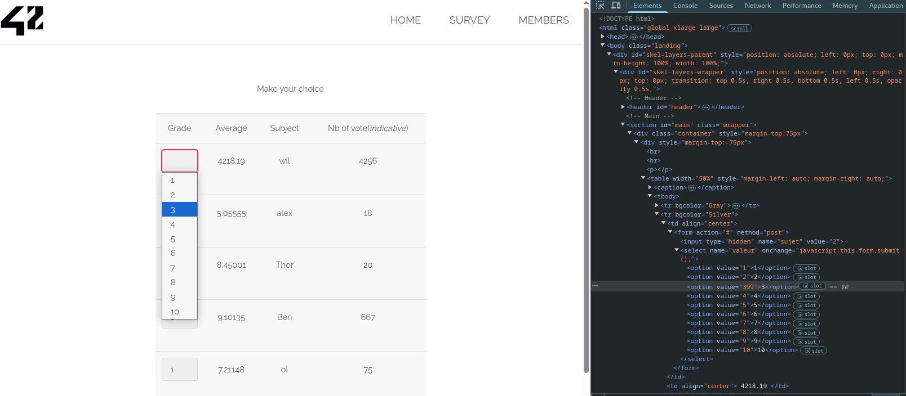
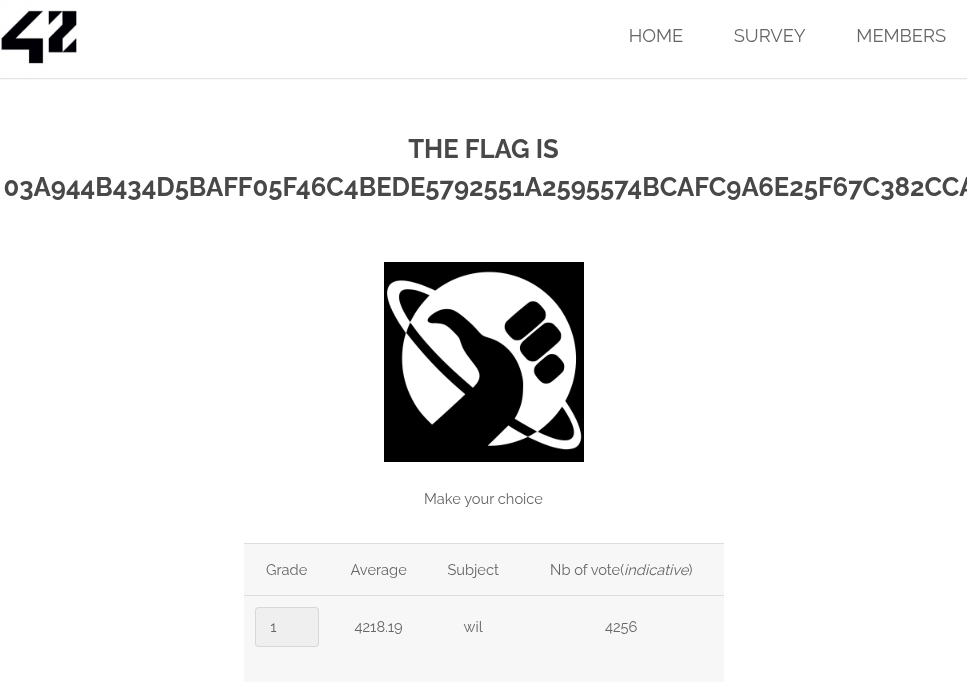

# Survey Form Manipulation (Improper Input Validation)

## Découverte
Nous avons trouvé un formulaire de vote/sondage qui limite les notes de 1 à 10 dans l'interface utilisateur mais qui ne valide pas correctement les entrées côté serveur.
http://10.13.248.97/?page=survey

## Vulnérabilité
Faille de type **"Improper Input Validation"** où l'application n'effectue pas de vérification côté serveur pour s'assurer que les valeurs soumises sont dans la plage autorisée.

## Exploitation
1. Inspection du code source de la page dans la console pour identifier la structure du formulaire et modification de la valeur d'une option dans le menu deroulant
   

2. Soumission du formulaire (changement de la valeur "3" en "399"),
   
ce qui a permis d'obtenir le flag
   

## Atténuation
- Implémenter une validation rigoureuse côté serveur pour vérifier que les valeurs soumises correspondent aux valeurs autorisées
- Utiliser des listes blanches pour les entrées acceptables
- Ne jamais faire confiance aux données soumises par le client
- Mettre en place des contrôles d'intégrité des données dans la base de données
- Faire correspondre la validation côté client avec celle côté serveur