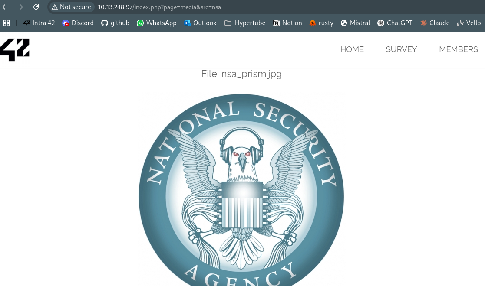
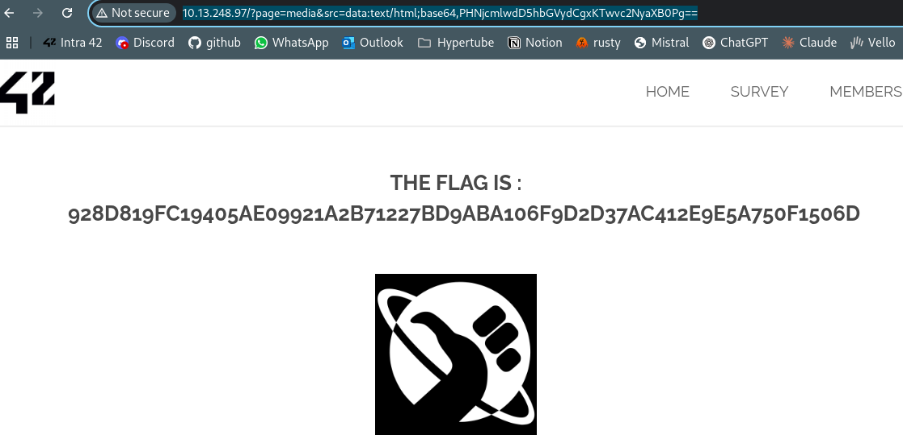

# XSS via Data URI Vulnerability

## Découverte
Nous avons découvert une vulnérabilité XSS (Cross-Site Scripting) sur la page d'affichage des images du site web.
http://10.13.248.97/index.php?page=media&src=nsa

## Vulnérabilité
Faille de type **"Reflected XSS"** avec **"Data URI Injection"** où l'application ne valide pas correctement le paramètre `src`, permettant l'insertion et l'exécution de code JavaScript arbitraire.

## Exploitation
1. Identification de la page vulnérable affichant l'image NSA
   

2. Analyse de l'URL et du paramètre `src` contrôlant l'image affichée
   ```
   http://10.13.248.97/index.php?page=media&src=nsa
   ```

3. Tentative d'injection d'un script JavaScript simple pour vérifier la présence de la faille XSS
   ```
   http://10.13.248.97/?page=<script>alert(1)</script>
   ```
   
   

4. Analyse du code source de la page révélant que le contenu du paramètre `src` est inséré dans une balise `<object data="...">`

5. Exploitation du paramètre `src` en utilisant un Data URI avec un script JavaScript encodé en Base64
   ```
   http://10.13.248.97/?page=media&src=data:text/html;base64,PHNjcmlwdD5hbGVydCgxKTwvc2NyaXB0Pg==
   ```
   Où `PHNjcmlwdD5hbGVydCgxKTwvc2NyaXB0Pg==` est l'encodage Base64 de `<script>alert(1)</script>`

6. Confirmation de l'exploitation et accès au flag
   

## Impact
Cette vulnérabilité permet à un attaquant de:
- Exécuter du code JavaScript arbitraire dans le contexte de la page
- Voler les cookies de session des utilisateurs
- Rediriger les utilisateurs vers des sites malveillants
- Modifier le contenu de la page pour des attaques de phishing
- Accéder potentiellement à des informations sensibles

## Mécanisme technique
1. La balise `<object>` avec l'attribut `data` est conçue pour charger différents types de contenu
2. L'application n'effectue pas de validation sur le type de contenu fourni via le paramètre `src`
3. L'encodage Base64 permet de contourner d'éventuels filtres de sécurité
4. Le navigateur décode automatiquement le contenu Base64 et l'interprète comme du HTML valide

## Prévention
- Valider strictement les entrées utilisateur (whitelist des valeurs acceptables)
- Échapper correctement les caractères spéciaux HTML
- Implémenter des en-têtes Content-Security-Policy (CSP) pour limiter l'exécution de scripts
- Utiliser une liste blanche de types de contenu autorisés pour la balise `<object>`
- Vérifier le type MIME des ressources chargées
- Éviter d'insérer directement les entrées utilisateur dans des attributs HTML sensibles comme `data`