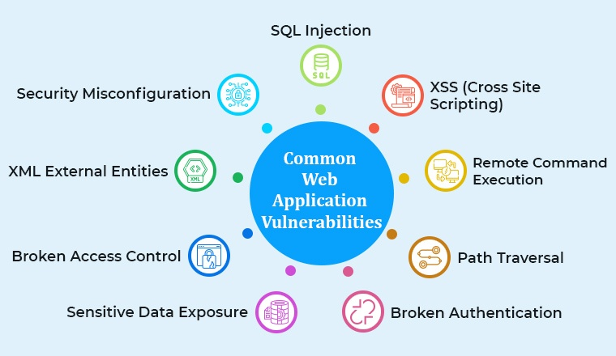
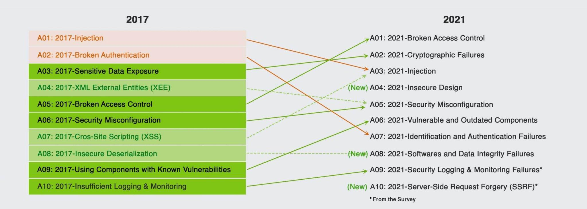
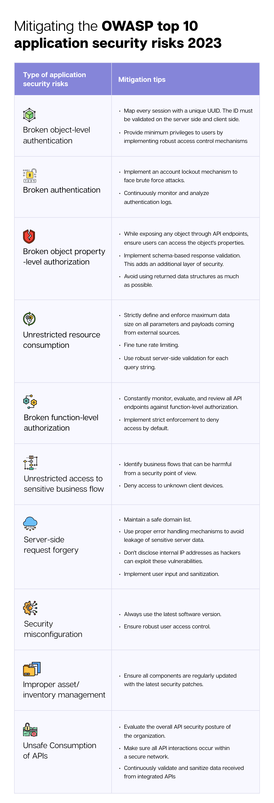

# Darkly


## Overview
Darkly is a project focused on web security vulnerabilities and cybersecurity awareness. This repository contains solutions and explanations for various security breaches identified in a deliberately vulnerable web application.



## Project Description
The Darkly project introduces students to cybersecurity in the field of web development. Through this project, we learn to:

- Identify and exploit common web vulnerabilities
- Understand the OWASP (Open Web Application Security Project) framework
- Discover security features that modern frameworks implement automatically
- Learn how to secure web applications against various types of attacks

## Repository Structure
This repository is organized by vulnerability type. Each directory represents a specific security breach:

```
Repository/
├── SQL_Injection/
│   ├── flag
│   └── Ressources/
│       ├── explanation.md
│       └── screenshots/
├── XSS_Attack/
│   ├── flag
│   └── Ressources/
│       ├── explanation.md
│       └── payload.js
├── ...
```

## Vulnerabilities Covered
The project explores 14 different web vulnerabilities, including but not limited to:

1. SQL Injection
2. Cross-Site Scripting (XSS)
3. Cross-Site Request Forgery (CSRF)
4. File Upload Vulnerabilities
5. Directory Traversal
6. Insecure Direct Object References
7. Session Management Flaws
8. Broken Authentication
9. Security Misconfiguration
10. Sensitive Data Exposure

## Learning Objectives
By completing this project, we gain:

- Practical experience in identifying security vulnerabilities
- Understanding of how attacks are executed
- Knowledge of mitigation strategies
- Awareness of secure coding practices

## Approach Methodology
For each vulnerability:
1. **Identification**: Recognize the potential vulnerability
2. **Exploration**: Test the vulnerability using various techniques
3. **Exploitation**: Successfully exploit the vulnerability
4. **Documentation**: Record the process and create proof of concept
5. **Mitigation**: Understand how to fix or prevent the vulnerability

## Evolution of Web Security Standards

The OWASP Top 10 list changes over time as new threats emerge and security practices evolve. The image below shows how the OWASP Top 10 vulnerabilities changed from 2017 to 2021, reflecting the dynamic nature of web security:



Understanding these changes helps security professionals stay current with the most critical security risks. Some vulnerabilities persist across years (like Injection attacks), while others are reclassified or merged as the security landscape evolves.

## Security Mitigation Strategies

Knowing about vulnerabilities is only half the battle - implementing proper defenses is equally important. Here's a summary of mitigation techniques for common web security risks:



These practical defense measures help developers build more secure applications by addressing specific vulnerability types with targeted solutions.

## The Web Security Ecosystem

Web security involves multiple interconnected components and potential attack vectors. Modern security approaches must consider the entire ecosystem:


From phishing attempts to malware, credential theft to insecure APIs, the web security landscape requires vigilance across numerous fronts. This project helps understand these connections and how vulnerabilities can be exploited through different pathways.

## Resources
- [OWASP Top Ten](https://owasp.org/www-project-top-ten/)
- [Web Application Security Testing Cheat Sheet](https://cheatsheetseries.owasp.org/)
- [Mozilla Web Security](https://developer.mozilla.org/en-US/docs/Web/Security)

## Other interesting resources
- [World's Biggest Data Breaches & Hacks](https://informationisbeautiful.net/visualizations/worlds-biggest-data-breaches-hacks/)
- [Top 3 OWASP Vulnerabilities and How to Deal With Them](https://www.zippyops.com/top-3-owasp-vulnerabilities-and-how-to-deal-with-them)
- [What is a Data Breach? Types of data breach? How to stop one?](https://www.testbytes.net/blog/what-is-data-breach/)
